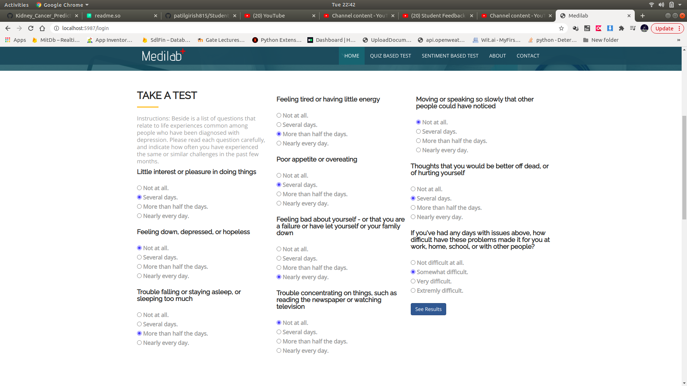
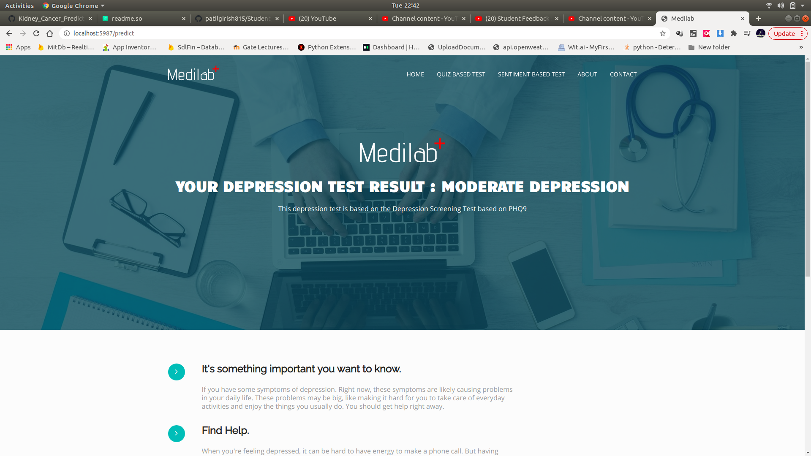
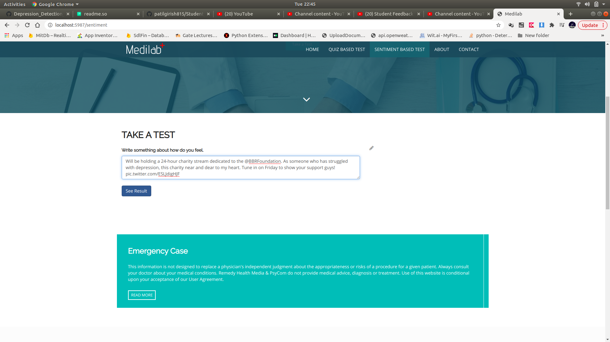
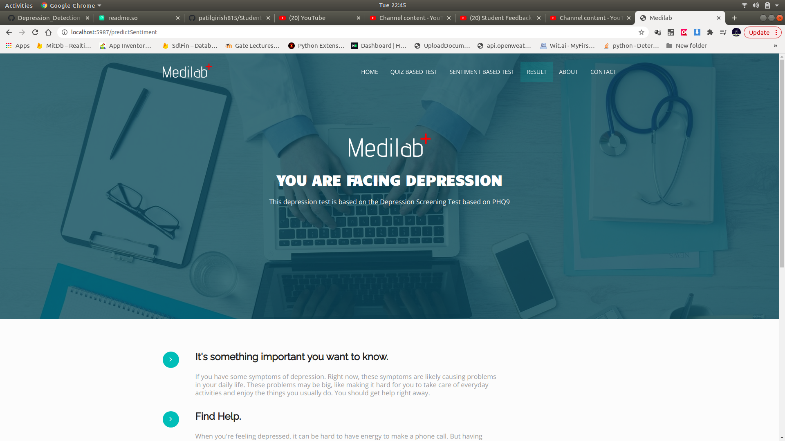
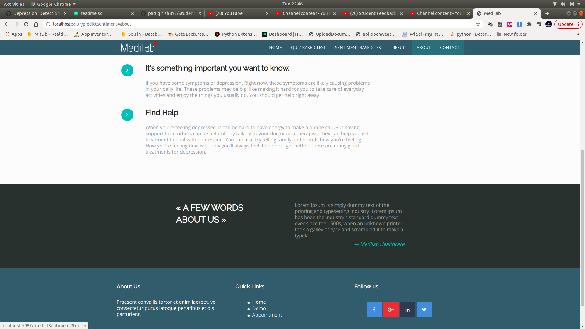

# Depression_Detection_Using_ML_Algorithms
This project used data from social media networks to explore various methods of early detection of MDDs based on machine learning. We performed a thorough analysis of the dataset to characterize the subjects’ behavior based on different aspects of their PHQ9 question answering, textual inputs, Python code for Depression Detection using multiple machine learning algorithms and Twitter dataset for detecting depression also from sentiments

### To run application

1. Install all libraries
$ pip install -r requirements.txt

2. Run the application
$ python server.py

3. In Browser open URL localhost:5987

4. Login Using:
   - Username :admin
   - Password :admin
   - *Note : Username and password can be chnaged in server.py file

### Demo
link : https://youtu.be/CucCcR7J-yc

